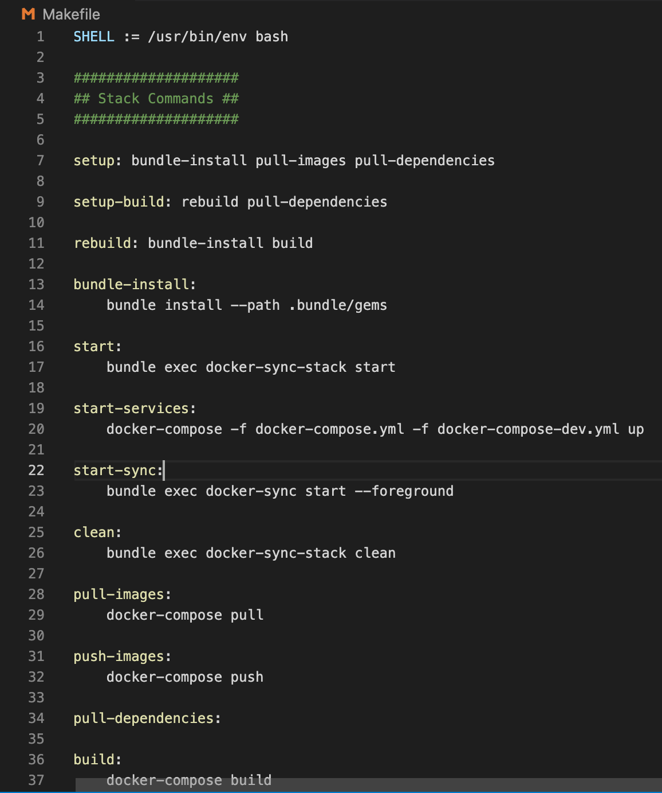
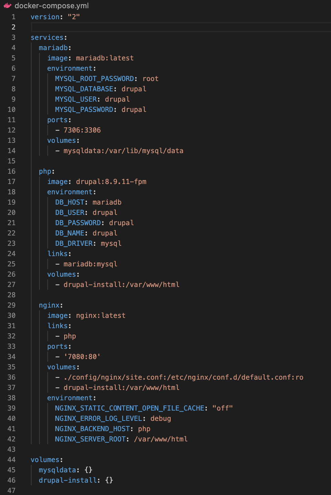
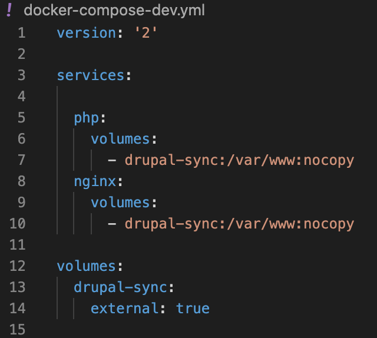
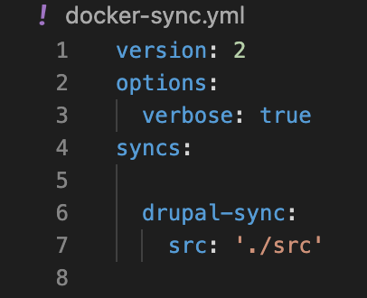

# 12-factor-demo (DON'T USE THIS REPOSITORY YET)
This is a direct fork of ActiveLamp/12-factor-demo; with the intent of attempting to bring it up to date as a Drupal repository for Docker with a Docker-Sync component
facilitating local site development.  In addition to moving to Drupal 8.9.X for the basic install, watch to see if progress is made to add a much richer Composer.Json file
to 'Base' so that a user has a real jump start on a configured Drupal install with some key contributed modules.  The other intent is to work with the Docker-compose files
to add some development tools into the container so that a new developer has some perspective on moving back and forth between their local harddrive and the container.  That way
one can see the changes make locally and how they are 'taking' in the container.  The Docker-Sync capability is set to make sure that is happening automatically behind the scenes
but I find it valuable to 'peek' inside the container when I am trying to debug any bumps (https://docker-sync.readthedocs.io/en/latest/index.html).  That probably has two
general values; 1) just learning and 2) trying to do a 'move' rather than a clean new site install and build.  In this later situation you might want to check #hash, autoload
builds, composer install .json and .lock results, settings.php, local.settings.php, etc. to assure the prior and new container environments have working cross matches.  

The original ActiveLamp repository was contributed by Tom Friedhof.  It takes its name as a 12-factor-demo based upon Heroku putting out a 12-factor recommendation for software
as a service best practices.  Mr. Friedhof provides an explaination of the factors as his original repository in a series of YouTube videos (www.youtube.com/watch?v=FiaLKwdv9TI
and https://www.youtube.com/watch?v=BhdSn6XlmWo).  One of the most critical points is having a Development, Staging-Testing, and Production environment to how you work.  Being
able to use the Docker-Sync in the Development environment so it 'speaks' to your container is a great starting point in what he has provided. As noted above, I believe adding
some development tools for use within the container has some further value.  However, that said, I believe in full alignment with Mr. Friedhof's point of keeping three separate
environments and that NOT having the extra 'tools' in the Production environment makes perfect sense. So as progress is made on this respository, one might expect core container
production elements in a common Docker container definition applicable to all three environments and the inclusion of Development tools only in the Development environment, and
the additional of the Testing Tools only in the Staging-Tesing environment.  All this leads toward an approach to a CI/CD (Continuous Integration/Continous Deployment) logic. 
It is likely that one will want to leverage both a GitHub repository and a DockerHub repository to fully support the CI/CD approach; with separate Dockerfiles for development
and testing being called intothe Base container from DockerHub registry.

If you are reading a GitHub 'Readme' file it might be safe to assume you "get" GIT.  But if not, familiarize yourself with how to use that before diving into this. Obviously this
site has some good help if you are into reading "Managing workflow runs" (on this site).  I think one of the easiest overviews is to see Git and GitHub in use with Visual Studio
Code and there is a good video series on that "Visual Studio Code | How to use git and github"  (https://www.youtube.com/watch?v=Fk12ELJ9Bww).  Plus Visual Studio Code is a good
way to work with Docker "Manage Docker Easily With VS Code" (https://www.youtube.com/watch?v=4I8CRAzPLD4) and Docker Desktop has made it easier to see and manage your containers.
We will also see if we might integrate a Portainer capability in this repository at a later date (https://www.youtube.com/watch?v=d_yCqZIui80).  But back to Git, for a good 
reminder of basics consider "A Git Cheatsheet of Commands You Might Need Daily" (https://medium.com/swlh/git-ready-a-git-cheatsheet-of-commands-you-might-need-daily-8f4bfb7b79cf).
Plus, when your best approach is to take down the containers, clean the old local project install and start over, consider "Everyday Git: Clean up and start over" 
(https://everydayrails.com/2014/02/27/git-reset-clean.html).  If you really want a fairly deep GIT/GITHUB training overview to include setting up your SSH connection for updating
between local and GitHub, using branches and forking, there is about an hour and ten minute video worth watching called "Git and GitHub for Beginners - Crash Course"
(https://www.youtube.com/watch?v=RGOj5yH7evk).

# QUICK START
1) Pulling down the clone:
                              `git clone https://github.com/RightsandWrongsgit/12-factor-demo.git`

 *NOTE: this example syntax is NOT from a ‘Fork’, so you will want to change the ‘https:// …  ‘ part of it to use your own fork’s clone address.  

2) Now local, change into the working directory of what you cloned:    `cd 12-factor-demo`

3) Run:    `Make Setup`

4) Run:    `Make Start`

5) Go to your Browser address bar type and hit enter:    `localhost:7080`

6) Open Visual Studio Code and click the 'Source Control' icon where you will initialize your local Git repository (Or do it in your own favorite Git/IDE environment)

--------------------------------------------------------------
# WHAT'S GOING ON & ADDTIONAL STEPS TO TAKE THINGS FURTHER
### The makefile
The first file to take a look at in the GitHub repository is that “Makefile” .   Think about it as the file that you are going to run to invoke the establishment (Make Setup) of a
Docker container and then to run (Make Start) the container.  Start with the line 'Bundle-Install:' and 'Start-Sync:'.  These are behind making the Docker-Sync function work 
and the name 'gem' is in reference to the fact they are written in the Ruby language.  So you might want to glance at the the 'gemfile', 'gemfile.lock' and at the hidden directory
'.bundle' which contains this function's configuration files and supporting components. (Remember Cmd+Shft+period can be used to show hidden files on a Mac).  

The lines you probably want to pay the closest attention to are the 'Setup:' and 'Start-Services:' steps.  Recalling that you will run the (Make Setup) and (Make Start) steps from 
the command line, you will want to trace what they are doing by looking under each.  You can see commands that do typical things like Pull and Push images, invoke Docker to 
install and build, and grab files like docker-composer.yml and docker-compose.dev.yml that define the container environment.  
\
In the above line - "Start Services:"\
Understand the sequence of multiple compose files at:\
https://docs.docker.com/compose/reference/overview/#specifying-multiple-compose-files
\
### The docker-compose.yml file
The ‘docker-compose.yml’ file is the place where the container environment is established.  There are all sorts of videos and other resources that tell you how to set up
the container so I don’t go into a bunch of detail here.  The key thing to know is that containers are made up of ‘images’ and that ‘images’ are pulled from places like
DockerHub.  Images are the parts and are assembled into the whole; assuring that the parts talk to each other is one of the key things in defining the docker-compose.yml
file.  Think of what the ActiveLamp/12-factor-demo GitHub has in its docker-compose.yml file is just the core basics.

What we want to do is relate this docker-compose.yml file to how it works in the overall system.  The core basics is fine in some regards but has limitations in others. 
Thus, glance back up at the "Start Services:" lines in the Makefile to understand how one might expand from the basics.  You see in that line how docker-compose.yml is
followed by the docker-compose-dev.yml file and the key of what you need to know is that the line processes left to right; meaning if you put additons after the
docker-compose.yml file in a subsequent file on that line the commands in the following file will add to or override those in the preceding yml file.  Why we care about
this is that certain stuff we want in our development environment like tools to build our site but we want to remove them from being in the production environment so they
don't create a security risk.  On the flipside, there are some things we want in our production environment to make it faster or work across server, etc. that would get in
the way if we had them in our development environment.  And, of course, we want our testing environment to pretty much match our production environment but we may have some
of the testing tools themselves that should be excluded from production.  As this project repository develops, you might anticipate we will add further functionality
in a Development, Staging-Testing, Production orientation to support CI/CD workflow.

Under the _php:_ line in the docker-compose.yml file shown above, you will notice  an _image:_ line with a _drupal:version_. In the original ActiveLamp repository the Drupal
image: was _drupal:8.3-fpm_ but in this repository it has been changed; and YOU might want to change it yourself at some point if you need to.  It really doesn't specifically
matter which Drupal version is in this docker-compose.yml file because the actual Drupal site install is done in a later step via the Composer.Json file (which is discussed
later in this documentation). ***However, the version used in this docker-compose.yml file should preceed or equal the one you plan to use in the final site install step to 
take advantage of backward compatibility***. The reason the change was made between what ActiveLamp repository used and what this one uses is because you need an image to still
be available on the DockerHub registry to be called in the build.  The ActiveLamp image of 8.3-fpm didn't show on the list any more and thus one key is to update this starting
point to a Drupal image that is available on the DockerHub list.  If this repository isn't current when you use it, check DockerHub for an available Drupal image and do this edit
beforethe "MAKE" step is run.\

Sharing what you do to your application on the HOST with the container that will run the application has a couple key aspects to it.  If we think of Containers like 'vapor'
the question must be addressed regarding how my efforts will be saved or persist after working on them. And we also need to address the question of how and the heck do I
do work inside this Container in the first place.  If our repository, we see how these questions are being addressed via loading the Docker-Compose-Dev.yml file following the
load of the Docker-Compose.yml file in that 'Start Services:' line in the Makefile.  This Docker-Compose-Dev.yml file is using the Docker "Volume" function to address that
persistency question and the Docker-Sync.yml approach as a way to have edits you make on your local host files to syncronize with updates to the files in your Container.\ 

\

The concept of Docker Volumes is one of the standard ways that Docker itself has the Container store stuff on your local host.  Inside the running container there is a writable
layer for your data and you want it in there for performance.  But to get your information to persist after the container is shut down for any reason, you want the information
to be stored and Docker offers a couple ways to do this.  Volumes is one of the ways and as this is being written, is noted by Docker as the preferred approach.  You can learn
more about this on the Docker site (https://docs.docker.com/storage/volumes/).\

### The docker-sync.yml file
Perhaps the most interesting syntax in the Makefile is the call to docker.sync; a function that basically is the coordination point for how your HOST outside the container talks
with the inside of the container.  The ‘docker-sync.yml’ file at the instruction on the line 7 example; it is telling this tool that we want to share the ‘./src/web/profiles’ directory on our HOST computer (and all subdirectories and files beneath it) with the container.  We have a related instruction in the docker.compose-dev.yml file to tell php within the container where it is to get the files it needs.  It says to get those files from ‘drupal-sync’ and then to make them available within the container in the ‘/var/www/html/profiles’ directory. In essence, this says “Use the files from ‘-drupal-sync:’ and mount them in the volume ‘/var/www/html/profiles’ within the container.   REMEMBER THAT IF YOU CHANGE THE LOCAL HOST DIRECTORY FOR THINGS LIKE EXISTING SITES OR FOR A MULTI-SITE STRATEGY, YOU NEED TO ADJUST THE LINES NOTED IN THE ABOVE TWO POINTS!

A change to the HOST:CONTAINER directory synchronization edit is made between Mr. Friedhof's first and second video. The reason that this change is made is discussed in the
second active lamp video by Tom Friedhof; “Factor Two - Dependency Management with Docker, Drupal, and Composer” (https://www.youtube.com/watch?v=BhdSn6XlmWo).  In a 
nutshell, the reason is because how and where he did the local host installation of Drupal using container; to /var/www/src rather than /var/www/html.  The key thing to 
understand at this point is that the above change is in the docker-sync.yml file where line six is drupal-sync: and line seven is scr: '/.scr' now. Then in the
docker-compose-dev.yml file note for both php and ngnix that volumes are declared where drupal-sync is telling the container where to locate the application files it is
referencing from your local machine as -docker-sync:/var/www:nocopy   You might find "Docker Basics: How to Share Data Between a Docker Container and Host"
(https://thenewstack.io/docker-basics-how-to-share-data-between-a-docker-container-and-host/) a good way to get an overview of what "Volumes" are doing for you in Docker.
    
Lets Get Ready by Putting Drupal On our Local Host Machine
The real key to what Tom Friedhof’s approach is that inclusion of docker-sync so the Host easily coordinates with the docker container.  That said, we need to get Drupal
on the host machine.  Freidhof’s second video really outlines that process through its discussion of Dependency management with Docker, Drupal and Composer.

## The Clean New Site Approach:
Not to be confused with ‘docker-compose’ there is something called “Composer” that is a dependency manager for PHP.   Drupal is written in PHP, and Composer has been essential
to working with Drupal since version 8.  Most people who have worked with Drupal are aware of Composer primarily as the thing that makes sure the “Modules” you add to the
basic or core installation of Drupal all work in concert with one another; thus the picture of the orchestra conductor on the Composer website.  You need to have Composer
installed at this point to continue.  (https://getcomposer.org/download/)

To make it easy by leveraging someone else’s good thinking, you can do a search for ‘composer template drupal’ to find a good starting point.  It should take you to a
GitHub - drupal-composer/drupal-project: Composer template for Drupal projects.

Add - the key next thing to put in documentation is how you remove the docker-compose.yml installed .src directory and below, replacing it with an empty .src directory 
in which you run the correct version of (https://github.com/drupal-composer/drupal-project/tree/8.x).  It is likely that this current repository should edit a branch and
merge it back to MASTER with that step done.  And that a copy of the Drupal install to put in it should be forked from the original to be stored as an addtional 
companion new repository in RightsandWrongsgit; but it should be edited to specifically make the install into the .src directory replacing the 'some-directory' statement
in the orginal before forking.  But this should be outlined in the documentation is fair detail so if these RightandWrong repositories get dated a user can do this update
themselves.  It appears the Drupal-composer/drupal-project repository is very actively managed so users can get the most current versions.  But make sure to include a
good discussion of what might be implied for 'major versions' and for key support like Composer, Drush, and PHP version continuity checks they should make.

### Inclusion of a db-backups subdirectory: 
This repository has an addition not included in Mr. Friedhof's at the project (top) level called db-backups.  The original .gitignore file was also modified so that any database
files put into that db-backups subdirectory aren't included in .git for pushup to your github repository. Thus, db-backups is basically have an empty subdirectory; but we put a
.keep file in it so it is acknowledged by Git and retained as you clone/pull/push with Github. There are two broad reasons for this database backup subdirectory. First, remember
we are attempting to build a 'WORKFLOW' logic to our design and you may logically want to have a 'work spot' to bring a copy of your production database into locally as you cycle
through your work flow. Second, this respository is attempting to create a reasonably automated process to jump start a new site with relatively novice skills and this database
subdirectory can house a canonical working database that may contain minimal site content resources related that configurs some select module, taxonomy, configuration information
past what Drupal itself houses (with a project.sql.example name for inclusion the git/github management). This second point may seem odd, and Drupal.Org has extensive discussion
of Drupal configuration management that is mainly managed with .yml files from Version 8 forward; but also comments how it stores configuration elements in the database. For
additional discussion of these directory structure changes see "Dockerize an Existing Project" (https://drupalize.me/tutorial/dockerize-existing-project?p=3040).

Add - A specific project.sql.example file into the db-backups subdirectory and instructions here on renaming it.

Add - inclusion of and discussion of detailed workflow value of using the .env approach to environment management.  See if the environment can be fully common between the 
Development, Staging-Testing, and Production elements of each supported site in a multi-site but simply use DockerHub registry held version of each workflow element with 
appropriate Dockerfile versions for each.  (https://gitlab.com/florenttorregrosa-drupal/docker-drupal-project/-/blob/8.x/example.dev.env).  Review the example .env file
from this Drupal template for to make sure we are clean (https://github.com/drupal-composer/drupal-project/commit/2d48c40ad9a8187f12fda5ee74d1830f1d0086b4).  It will also
pay dividends to cross check best practices here (https://github.com/vlucas/phpdotenv). And, make sure this is coordinated with the credentials approach as noted here for
'autoload' (https://stackoverflow.com/questions/30881596/php-dotenv-unable-to-load-env-vars) remembering that the ActiveLamp starting point is working the autoload in the
vendor subdirectory 

# TO BE CONTINUED
## Stuff I need to add to the functionality and documentation of this repository after the clean new install is fully running
Add - Discussion of a couple hosting option alternatives.   The overview that shows how you put more into your Docker-compose and/or Dockerfile project definitions that later
if its content around 16 minute in includes one realatively generic hosting option "Putting it All Together - Docker, Docker-Compose, NGinx Proxy Manager, and Domain
Routing - How To." (https://www.youtube.com/watch?v=cjJVmAI1Do4).  But also offer the deeper support option of Lagoon with Amazee.io hosting as discussed in "How to manage
Multiple Drupal sites with Lagoon" (https://www.youtube.com/watch?v=R2tIivVvExQ&feature=emb_rel_end) | May want to work directly with Amazee staff on final coordination after
providing them with the basic structure and logic from the other elements in this repo. |  One key element to reconcile is that the multi-site logic of the Logoon approach
discussed in this video takes precedence over the multi-site aspect of the "Dockerize an Existin Project" directory layout; but NOT over the database backup aspects.  And, make
sure a user discussion of the benefits over classic drupal multi-site config approach is provided in summary so they only have to watch the Lagoon video if they want super
detail.  And don't forget to include the "Secrets" approach to protecting credentials in corrdination with the gitignore specifications. 

Add - cross check the original Active/Lamp approach to the Drush installation to make sure it is updated to the latest Drush version.  And in the process cross check
this repository on good Drush with Drupal practices (https://stackoverflow.com/questions/35743801/how-to-use-docker-with-drupal-and-drush).

Add - Review of the "Tools" to include in the Development version of a Dockerfile to add to DockerHub registry that can then be pulled by the common Docker-Compose.yml
file that cuts around all workflow stages.  For the tool set in Development (https://github.com/glaux/drupal8docker/commit/59b9821b0db96ad007e443ccf79fae8f2154dbe3). Then
to get the Docker-compose.yml file and the Dockerfile to work with one another and share the same network consider the design logic discussed here 
(https://stackoverflow.com/questions/29480099/whats-the-difference-between-docker-compose-vs-dockerfile#:~:text=The%20answer%20is%20neither.,to%20your%20project%27s%20docker-compose.&text=Your%20Docker%20workflow%20should%20be,images%20using%20the%20build%20command.).

Consider Adding - A discussion of Path management so people who have any install hangups know where to look and what to tweak on their systems
(https://stackoverflow.com/questions/36577020/php-failed-to-open-stream-no-such-file-or-directory).  Include the Docker best practices for path management in the ENV 
approach (https://docs.docker.com/develop/develop-images/dockerfile_best-practices/).

Consider Adding - A discussion of options for customization of Drupal Scaffolding beyond that of an automatic install
(https://github.com/drupal/core-composer-scaffold/tree/8.9.x).

Add - An overview of various approaches to Backups for your application and database.  Using linked sources but relating them in the discussion to the modification made to
the directory structure for local backups to be brought down and used as well.

Add - At least a discussion of MAKE and possibly scripting generally with emphasis on MAKE.  Do this when considering automation of the workflow Docker-compose.yml and 
Dockerfile versions to be put on DockerHub registry.

# SUPERNOVICE APPENDIX: 
If you are just starting out looking at different options for building a website, sometimes it can seem pretty complex.  Often times people are used to using their computer 
with all the GUI (Graphical User Interface) applications we have come to enjoy.  But if you are going to enter the world where you are developing your own website, you are
now going to get a little underneath the covers.  Drupal is a CMS (Content Management System) that really has extraordinary capabilities to do sophisticated websites.  It has
reputation of being 'hard' and in some senses that is true if you haven't ever programmed much before.  Therefore, lots of people default to some of the very simple options 
for putting up a website with just a few pages; almost like printing several ads on different pages of a newspaper and telling on each page what page numbers to turn to if
the reader whats to see the other ads.  That's ok if you aren't interesting in changing the content to fit the site vistor or offer tools for them to explore what you are
offering, or don't want to include forums, blogs, electronic purchases, etc.  Even if you don't initially plan to use these more advance features, some people would still 
start out with a simple Drupal site just to position themselves to expand more easily as their needs grow.

The way this GitHub Drupal repository is set up, its aim is to make it much easier to get started with Drupal than many other options.  That is because it uses something 
called 'containers'; actually pretty advanced stuff in some senses but set up here to kind of partially automate your start.  The key thing about containers is that they
contain both your application (e.g. Drupal) and its operating environment (e.g. the server & tools).  That way you sort of spin up both at once for a quicker start.  That 
said, it is still a little harder than just driving around existing applications you might have on your computer.  And you will need to use things like a 'terminal' for 
'command line interface' (CLI) to the guts of your computer.  Therefore, this SUPERNOVICE section is provided to give you some guidance in the basics.  It is stuck here at
the end because many people who will use this GITHUB repository will be experienced developers who don't want to read through a bunch of stuff that they already know.

## OPERATING SYSTEMS & SHELLS -
You probably are on a Mac or Windows, possibly even Linux; these are operating systems (OS).  Other than knowing which one you are using and some occassional differences in how
you do various tasks, I won't review the details of each OS.  There are all sorts of things on places like Wikipedia that give nice overviews and histories.  But one thing
you probably should know is that each of these OS's has something called a 'Kernel' that is like a set of commands that get the computer what to do.  And you talk to the
Kernel with what is know as a 'Shell'.  Again, there are a couple different Shells but they are pretty consistent at their most basic level.  Mac is using 'zsh' but in most
regards it is just a more capable version of BASH; and BASH is generally available across operating systems (if you want to argue that, then you obviously aren't a novice, so
move on).  BASH has some files that can be edited to provide 'scripting' (or a series of commands to be run).  But for use here, all we want to do is to edit your BASH file
that manages what your command prompt looks like (that > or $ typically present when you open a terminal).  If you use a Mac you probably know that your FINDER application shows
you where files are in various directories and on Windows it is something called EXPLORER. If you have worked with those you know you often have subdirectories below 
subdirectories below subdirectories.  With FINDER OR EXPLORER you can visually see where you are when you point to a file.  But imagine you are working just from a single
line like a command prompt on a terminal and you could be lost as to where the heck you are.  Therefore, we are going to start by modifying the BASH file in a way that make
that prompt show you information.  There is something discussed later called 'GIT/GITHUB' regarding your connection to a remote computer and we want to know where the heck
we are on both our local computer and the remote computer.  So the BASH file edit outlined next does both.

## KNOWING WHERE YOU ARE -
You want to edit the .BASH_PROMPT file.  The 'dot' in front of it hints that it is a hidden file.  On a Mac you can hit CMD SHFT DOT and it will show hidden files.  Then copy
the code from this link, paste it in and save it.*  (https://raw.githubusercontent.com/mathiasbynens/dotfiles/master/.bash_prompt).  Next time you open the terminal you should
have a command prompt that shows you a colored two part prompt that indicates first what local subdirectory you are in and second where you on on GITHUB (since you probably
haven't set up and logged into GITHUB yet it probably won't show anything for the second part yet, but trust me, it will later and be very helpful).

* You edit these in a text editor and if you are using the terminal in the apple/mac/iOS system you need to make sure that editor is set up for the right formats.  That editor
will use the keyboard function setting of your operating system and those are set in your “System Preferences” “Keyboard” in an OS system.  There is a tab called “Text” in there
and a box on that tab which, if checked, using “smart quotes and dashes”… Uncheck that box or you will be screwed up because the terminal can’t use that style quote and dashes in
its commands.  

## SETTING UP YOUR BASIC SYSTEM BEFORE YOU GET STARTED
### WITH THE DRUPAL DOCKER CONTAINER 

Flesh these out with more explanation or source links but basically the following (note this is MAC oriented initially, then add Linux and Windows later) ...

* Install Homebrew
* Install Git
* Obtain GitHub account
* Establish SSH Key to GitHub account
* Install Visual Studio Code (possibly via homebrew vscode option)

Add - Include a quick discussion of how to get to the parts of VSCode to invoke a terminal to issue git/github commands, to bring up the command palette (like CLI) via shift-command-p, and to install extensions (plus what key extensions will really help you get started).

# DIAGNOSTICS:
Sometime when you have problems it helps to know a few diagnostic tricks.  So some are provide here to at least get you started.  You can always search for more on specific topics
if you at least get some of the basics covered.

### Check the paths -
The first thing that is often a problem is that some file isn't being found as it is needed.  You know about directories from your Finder or Explorer look around your system. But
how does one part of your system know about files in another part?  This is where PATH comes into play.  You probably saw something like export PATH="/usr/local/git/bin:$PATH"
when you looked in the .BASH_PROFILE, .BASH_RC, and/or .BASH_PROMPT examples mentioned earlier.  This is how you show one part of your system to another.  Before you go messing
around with adding or editing those, two tips: 1) at your terminal command line interface type   echo $PATH   and hit enter to see what paths are present already and 2) See those
things that look like quotation marks... we need to make sure they are  neutral, vertical, straight, or ASCII quotation marks, NOT the curly or curve kind from a word processor.

### Check the Bash file logic -
Sometimes you will get someting like   :Command not found    on your terminal when you open it even if the prompt eventually shows up and lets you continue.  But you have no idea 
what command wasn't found, where, why, etc.  What you want to do is to debug the Bash files.  to do this put these two lines at the beginning and then the third line at the end
of your Bash file, open the terminal and it will have given you a dump that you can trace where that Command not found kicked out.

`set -x			# activate debugging from here`

`w`

`set +x			# stop debugging from here`

### Checking Git Configuration -
Sometimes you might question where Git is pulling its information and it it is set up correctly.  To see where it is pulling from run

`git config --list --show-origin`

